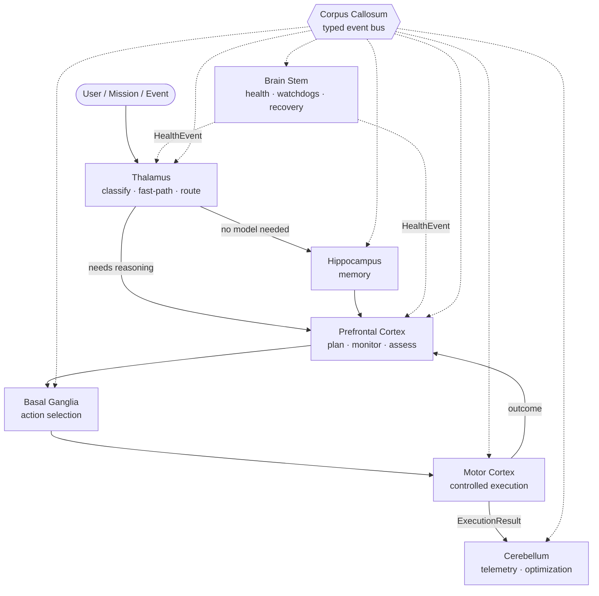

# Nexus Brain — Cognitive Architecture

> **The LLM is not the brain.** Models are interchangeable inference
> resources selected per-request by the Thalamus. Persistent cognition —
> memory, goals, plans, learned procedures, health, action history —
> lives in the regions below and survives model swaps, crashes, and
> restarts.



## Regions

| Region | File | Wraps / owns | Never does |
|---|---|---|---|
| **Corpus Callosum** | `brain/bus.py` | Typed `CognitiveEvent` delivery, addressed mailboxes, request/response by correlation, cancellation, bounded trace ring | Block a publisher on a slow region |
| **Brain Stem** | `brain/brainstem.py` | `HealthService` probes/recovery, resource snapshot (VRAM/RAM), crash history, watchdog tick | Depend on any LLM |
| **Hippocampus** | `brain/hippocampus.py` | Episodic/procedural/project SQLite store + facade over Answer Memory, knowledge graph, conversation memory, locked vault | Store model weights |
| **Thalamus** | `brain/thalamus.py` | Intent classification, deterministic fast paths, capability-based model selection over the live catalog | Hard-code model names |
| **Prefrontal Cortex** | `brain/pfc.py` | Plans, replanning, completion assessment, conflict monitor (loops/repeated failures/contradictions), strategy scoring | Execute actions |
| **Basal Ganglia** | `brain/basal_ganglia.py` | Action scoring (usefulness, history, cost, latency, risk, resource pressure), procedural habit boosts | Decide goals |
| **Motor Cortex** | `brain/motor.py` | Controlled execution via registered executors / ToolRouter; approval gates; structured `ExecutionResult` telemetry | Reason about goals |
| **Cerebellum** | `brain/cerebellum.py` | Metric trends, Digital Twin measures, bounded/reversible optimization lifecycle (propose → apply → rollback) | Modify model weights |
| **Specialists** | `brain/specialists.py` | `SpecialistBrain` regions (coding, research, vision, reviewer, systems, language): addressed bus citizens with domain-tagged episodic memory, `MEMORY_QUERY` domain-first recall, `LEARNING_EVENT` benchmarks, and `request_capability()` — model requests as requirements, never names | Duplicate global services |
| **Nexus Brain** | `brain/core.py` | Owns all regions, canonical `process_input()` flow, `status()`/`trace()` observability | — |

## Canonical input flow

`NexusBrain.process_input(text)` is invoked by `AgentOrchestrator.run()`
before any model work:

1. **Observation** event published (correlation id minted).
2. **Thalamus.route()** classifies the input:
   - deterministic fast paths answer in <1ms — `version`, `status`,
     `config` (bounded non-secret keys: workspace, models directory,
     active model), and `math` (safe `ast`-based arithmetic, never
     `eval()`);
   - trusted memory hits (`answer_memory` trusted rows) answer without a model;
   - otherwise a `RouteDecision` names the owning region + a capability
     `ModelRequirement` resolved to a live model id.
3. If a fast-path answer exists, the orchestrator completes the task
   immediately — no model process is touched. The HTTP readiness gate
   (`coding_model_setup_required`) consults `brain.answers_without_model()`
   first, so deterministic answers work on installs with no model at all.
4. Otherwise the normal pipeline runs; every hop is on the cognitive
   trace keyed by the correlation id.

## Memory architecture

Hippocampus separates memory by kind, each with confidence/provenance/
freshness and invalidation:

| Kind | Question | Backing store |
|---|---|---|
| episodic | what happened? | `brain/memory.db` `episodes` + activity log |
| semantic | what do I know? | Answer Memory, knowledge graph, knowledge memory, locked vault |
| procedural | how do I do this? | `procedures` table — success/failure counts raise/lower confidence |
| project | this repo specifically? | `project_facts` namespaced by project id |

Schema is versioned (`PRAGMA user_version`) — migrations are additive
and never wipe existing data. Connections are short-lived per operation
(the codebase convention — a persistent handle would lock the DB).

## Action selection & execution

```
PFC decides WHAT  →  BasalGanglia picks WHICH action (score =
  0.35·usefulness + 0.25·historical-success + 0.10·(1−cost)
  + 0.10·(1−latency) + 0.15·(1−risk) + procedural boost
  − approval penalty − resource-pressure penalty)
  →  MotorCortex.execute() → structured ExecutionResult
  →  Corpus Callosum → PFC conflict monitor + Cerebellum metrics
```

Motor Cortex refuses `requires_approval` executors unless the request
arrives `approved=True` — the gate is enforced at the execution layer,
not by prompt discipline.

## Failure & recovery paths

- Region handler exceptions are isolated by the bus — traced as
  `trace_error`, never propagated to siblings.
- `BrainStem.report_crash()` transitions a component to `crashed`
  immediately and publishes a high-priority `HealthEvent`; the Thalamus
  re-routes around dead models on the next `route()` call.
- Measured model latency (`MODEL_RESULT` events from real generations,
  recorded by the Cerebellum) feeds back into `_select_model` as a
  bounded ±2 score adjustment — historically faster models win
  capability-tied selections over time.
- `server.AppState` treats brain construction as optional — a failed
  region logs and degrades; the server still starts.
- `stop_state()` closes the brain cleanly (watchdog off).

## Observability

- `GET /api/brain/status` — per-region state, handled/error counts,
  specialist registry, component states, resource snapshot.
- `GET /api/brain/trace` — recent cognitive events;
  `?correlation_id=X` returns the collapsed hop list for one request.
- The System page (`web/system.html` → *Nexus Brain*) renders regions,
  specialists, and the live trace.
- Structural events are mirrored onto the existing `/api/events` bus as
  `cognitive` entries — no hidden reasoning tokens, only system-level
  hops.

## Event schema

```json
{"source": "motor_cortex", "destination": "prefrontal_cortex",
 "type": "execution_result", "correlation_id": "ab12…",
 "mission_id": "m-…", "confidence": 1.0, "priority": 50,
 "provenance": "motor_cortex", "content": {"action": "run_tests",
 "ok": true, "duration_ms": 850}}
```

## Future expansion

- Specialist brains gain local planning/evaluator loops (they are already
  addressable regions with domain memory and capability requests).
- Basal Ganglia → procedural memory writeback for repeated winning
  sequences (learned habits).
- Cerebellum-driven tuner proposals surfaced in the UI for approval.
- Frontier/cloud model profiles join the Thalamus catalog through the
  same `ModelRequirement` capability interface.
